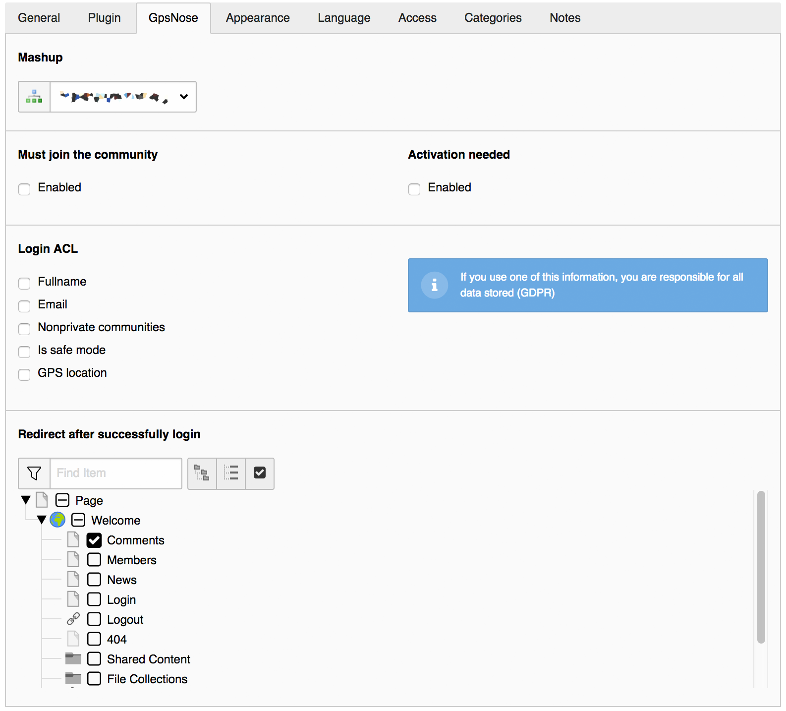
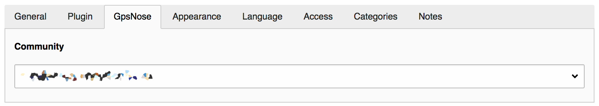
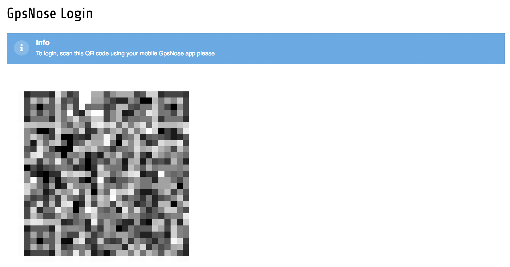
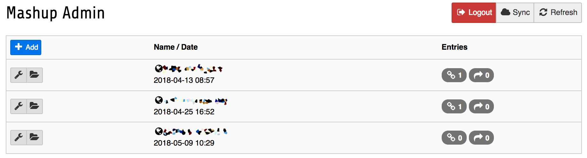
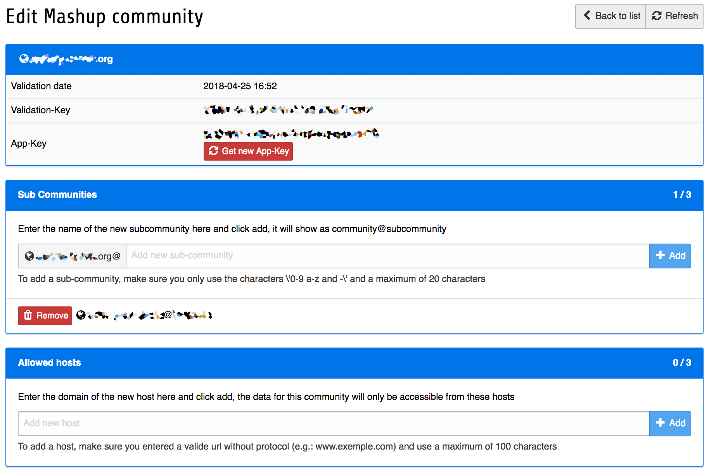

.. ==================================================
.. FOR YOUR INFORMATION
.. --------------------------------------------------
.. -*- coding: utf-8 -*- with BOM.

.. include:: ../Includes.txt

Introduction
============

What does it do?
----------------

The extension comes with several plugin to show content of GpsNose-Platform into a TYPO3 webpage.
List members, news, comments or let the user login as a frontend-user with the integrated QR-Code-Reader.

All you have to do, install the plugin, configure it, it's that easy ;)

Here's a tutorial in german (english subtitles are available):

.. youtube:: ef2E_jQJIZ4

Screenshots
-----------

Here some screenshots from the backend, so you have an idea of what's possible at this time

^^^^

    
    Plugin Login

^^^^

    
    Plugin Comments, Members, News

^^^^

    
    Module Login

^^^^

    
    Entry List

^^^^

    
    Entry Detail
