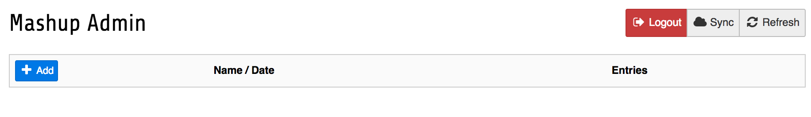
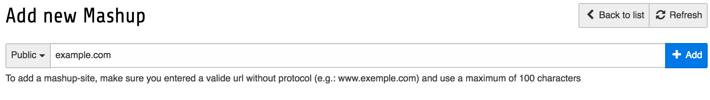
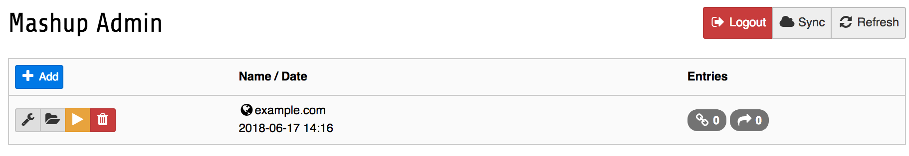

.. ==================================================
.. FOR YOUR INFORMATION
.. --------------------------------------------------
.. -*- coding: utf-8 -*- with BOM.

.. include:: ../Includes.txt

.. _module-manual:

Module manual
=============

If you like to use the GpsNose-Plugin, it is a must, to install the free GpsNose-App in your
Smartphone.

:For iOS:
	https://itunes.apple.com/us/app/gpsnose/id892215768

:For Android:
	https://goo.gl/4q4TGl

Create an account and validate it (only validated users are allowed to create new Mashup-Sites)

Open the GpsNose-Module (after installation the plugin, it will appear under the Admin-Tools on the left)
Use the QR-Code-Reader in the GpsNose-App to scan the the generated QR-Code in the Module.
Some seconds later, you should see the Mashup-Admin Page (empty list with an Add-Button)

    
    Empty list

When you click the Add-Button you get the create-mashup page, enter the name of your mashup-domain

    
    Add mashup-site

Click the Submit-Button, if the mashup-site is not registered by another user, you will see your temporary
created mashup-entry. As long as you dont validate it, it will be bossible to change the visibility of the new
mashup-site.

From now on, your page will provide a new meta-tag, this meta-tag will be used by GpsNose to validate the mashup-site

::

<meta name="gpsnose-validation-key" content="240dac81-573c-4a52-bc18-5e8a56a65d4d" />

If you are ok with your work, click the Validta-Button

    
    Validate mashup-site

After GpsNose has validated the meta-tag, it will return the API-Key to the TYPO3-Backend

When everything works like expected, you are able to edit your mashup-site

.. figure:: ../Images/backend-03.png
    :width: 100%
    
    Entry Detail

- Validaten-Key is only used to validate the mashup-site and does nothing after validaten was successfully

- App-Key is the secure 16 Byte key, dont show this information to anybody, it is your key to request data from GpsNose

- Subcommunity is used to create a hierarchical structure, the plugins will provide

- Allowed hosts defines witch host is allowed to request data from GpsNose

Target group: **Administrators**

