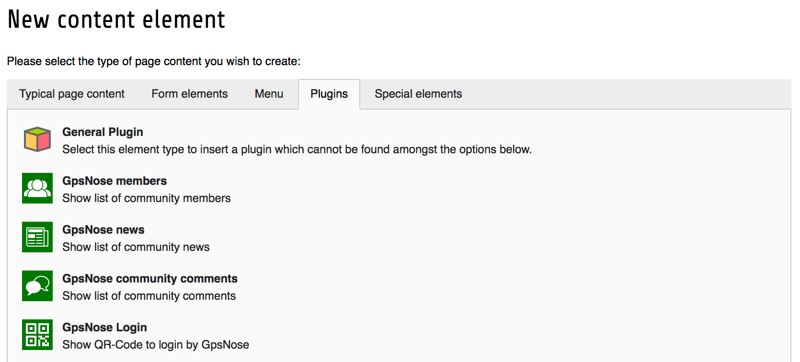

.. ==================================================
.. FOR YOUR INFORMATION
.. --------------------------------------------------
.. -*- coding: utf-8 -*- with BOM.

.. include:: ../Includes.txt

.. _users-manual:

Users manual
============

To add a new plugin which showing content of GpsNose members of your community, just go to the page
you like to show the data. Click Add new Content and switch to the Plugin-Tab

    
    Plugin add

Target group: **Users**

Link to official documentation
------------------------------

If you are new in TYPO3 there are some good tutorials:

- :ref:`TYPO3 Tutorial for Editors <t3editors:start>`
- :ref:`Getting Started Tutorial <t3start:start>`

